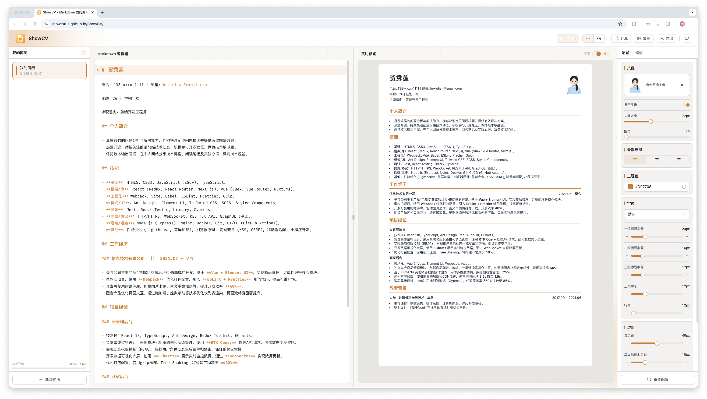
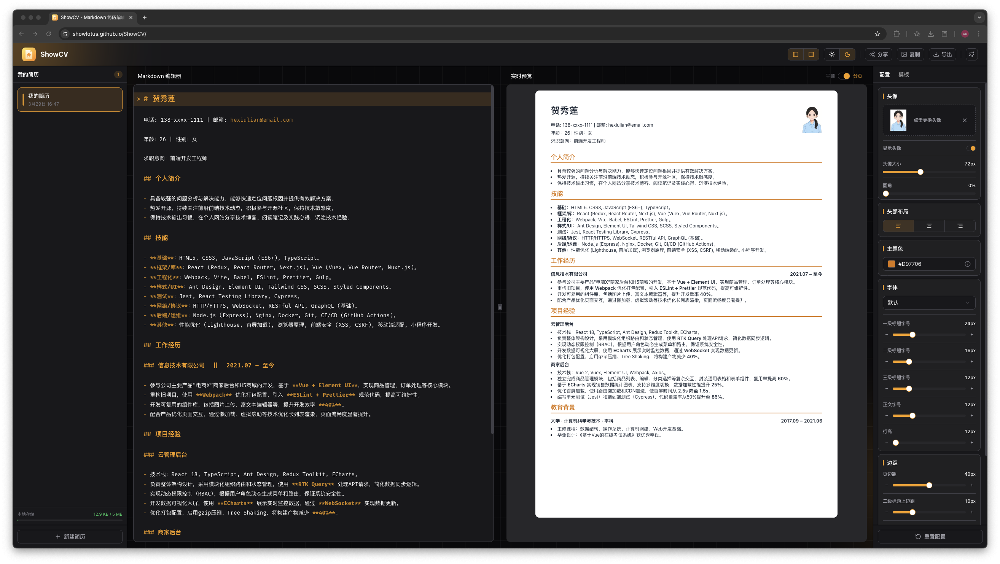

# ShowCV

> 基于 Markdown 的在线简历编辑器，支持实时预览、多种模板、PDF 导出和链接分享。（简历优化可参考 [job-prep-skills](https://github.com/showlotus/job-prep-skills)，含前端面试模拟等实用技能）





## 功能特性

- **Markdown 编辑** — 使用 CodeMirror 6 打造的编辑器，支持语法高亮和右对齐语法
- **实时预览** — A4 尺寸实时渲染，支持平铺 / 分页两种预览模式
- **多份简历** — 侧边栏管理多份简历，支持重命名、复制、删除，独立保存、随时切换
- **四种模板** — T1 经典 / T2 现代 / T3 创意 / T4 活力，多种风格满足不同岗位需求
- **头像上传** — 支持上传头像，可调节大小和圆角
- **主题切换** — 浅色 / 深色两套编辑器主题
- **样式定制** — 自由调节各级字号、行高、主题色、标题间距、页面边距、字体等参数
- **PDF 导出** — 基于浏览器打印，打印样式与预览保持一致
- **复制为图片** — 一键将简历复制为 PNG 图片
- **链接分享** — 生成分享链接，对方打开后自动导入简历内容（标记为"来自分享"）
- **标题双栏** — 支持 `||` 语法在标题中分隔左右两栏（如 `公司名称 || 2021.07 - 至今`）

## 快速开始

**环境要求**：Node.js 18+、pnpm

```bash
# 安装依赖
pnpm install

# 启动开发服务器
pnpm dev

# 生产构建
pnpm build
```

## 技术栈

| 分类          | 依赖                              |
| ------------- | --------------------------------- |
| 框架          | React 19 + TypeScript + Vite      |
| 样式          | Tailwind CSS v4 + shadcn/ui       |
| 编辑器        | CodeMirror 6                      |
| Markdown 渲染 | react-markdown + remark-gfm       |
| 状态管理      | Zustand（含 localStorage 持久化） |
| PDF 导出      | react-to-print                    |
| 截图          | modern-screenshot                 |
| 分享压缩      | fflate (zlib)                     |
| 动画          | anime.js                          |
| 布局          | react-resizable-panels            |
| 提示          | sonner                            |
| 图标          | lucide-react                      |

## 项目结构

```
src/
├── components/
│   ├── common/       # 通用组件：Slider、ColorPicker、Modal、Background 等
│   ├── editor/       # Markdown 编辑器（基于 CodeMirror）
│   ├── layout/       # Header、Sidebar（简历列表）
│   ├── preview/      # 实时预览区（支持 A4 分页）
│   ├── settings/     # 右侧样式配置面板、头像上传
│   └── ui/           # shadcn/ui 基础组件
├── services/         # PDF 导出、图片复制、链接分享
├── store/            # Zustand 状态管理
├── templates/        # 简历模板（T1/T2/T3/T4）及共用工具
│   └── utils/        # useCssVars、remarkGroupSection、PipeSplit、colorUtils
├── themes/           # 主题配置与 CSS 变量
├── types/            # TypeScript 类型定义
└── utils/            # 常量、工具函数
```

## 简历模板

| 模板 ID | 风格     | 适合岗位          |
| ------- | -------- | ----------------- |
| `T1`    | 经典简约 | 传统行业          |
| `T2`    | 现代专业 | 互联网 / 科技     |
| `T3`    | 创意设计 | 设计 / 创意岗位   |
| `T4`    | 活力新颖 | 互联网 / 新兴行业 |

## 样式配置项

在右侧配置面板中可调整以下参数：

- **头像** — 上传图片、显示/隐藏、尺寸（40-120px）、圆角（0-50%）
- **主题色** — 8 种预设色盘 + 自定义颜色
- **字体** — 字体族（默认 / 苹方 / 思源黑体 / 微软雅黑 / Times New Roman）、H1 / H2 / H3 / 正文字号、行高
- **间距** — 页面内边距、H2 上下间距、H3 上下间距

## 分享机制

分享链接将简历数据（内容 + 模板 + 配置）经 fflate zlib 压缩后 Base64 编码，存储在 URL Hash 中。对方打开链接后，数据自动解码并创建为本地简历（标记 `fromShare: true`），随后清除 Hash，避免 URL 过长。

## 常用命令

```bash
pnpm dev           # 启动开发服务器
pnpm build         # 生产构建（tsc + vite build）
pnpm preview       # 预览生产构建
pnpm lint          # ESLint 检查
pnpm format        # Prettier 格式化
pnpm format:check  # 检查格式
```

## 许可证

[MIT](LICENSE) © showlotus
