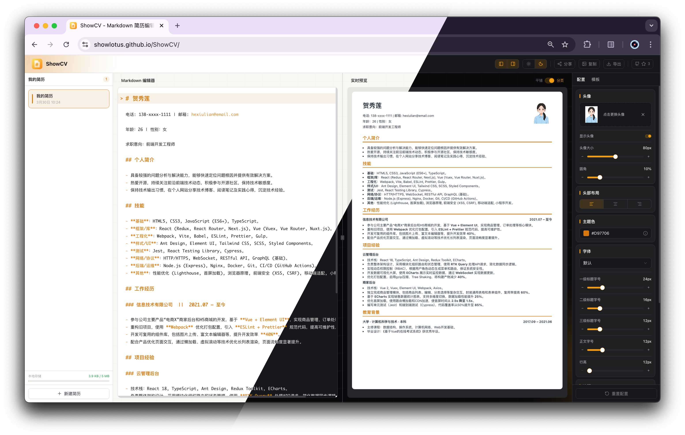

# ShowCV

基于 Markdown 的在线简历编辑器，专注于高效编辑、实时预览、AI 优化与高质量导出。核心功能客户端运行，分享与 AI 优化依赖 Vercel Serverless API。



## 快速导航

- [核心能力](#核心能力)
- [架构亮点](#架构亮点)
- [快速开始](#快速开始)
- [开发与测试命令](#开发与测试命令)
- [FAQ / 已知限制](#faq--已知限制)
- [贡献方式](#贡献方式)

## 核心能力

### 编辑体验
- 基于 CodeMirror 6 的 Markdown 编辑器，支持语法高亮与标题双栏语法 `||`
- 支持多份简历管理，可重命名、复制、删除并快速切换

### 预览与输出
- A4 实时预览，支持平铺与分页两种模式
- 基于浏览器打印能力导出 PDF，预览与导出样式保持一致
- 支持一键复制为 PNG 图片，便于投递与社交分享

### 模板与样式定制
- 内置 4 套简历模板（`T1` ~ `T4`）
- 可视化调整主题色、字体、字号、行高、段间距、页边距
- 支持头像上传、尺寸与圆角调节

### AI 文本优化
- 支持社招/校招模式，通过 Cmd/Ctrl+J 快捷键触发
- SSE 流式生成 3 个优化版本（标准/数据驱动/专家级），可手动编辑后应用
- 自动保留 Markdown 格式（加粗、双栏 `||`、行内代码、链接等）

### 分享协作
- 通过服务端 API 生成加密分享链接（AES-256-GCM），1 天有效，阅后即焚
- 对方打开链接后自动加载并导入简历内容，来源标记为 `fromShare: true`
- 分享数据经紧凑编码 + zlib 压缩后存入 Upstash Redis（Vercel KV）

## 架构亮点

- **Zustand 持久化状态管理**：核心数据持久化到 `localStorage`，并通过 `currentResume` 维护当前简历缓存，保证编辑体验与数据一致性
- **双层主题系统**：编辑器 UI 主题与简历样式主题解耦，便于统一 UI 风格与模板个性化定制
- **双 DOM 预览策略**：可见预览用于交互，隐藏原尺寸副本用于截图，避免 `zoom` 带来的截图失真
- **分页布局算法**：按 section 高度进行分页分配，保持分页预览稳定性
- **服务端分享链路**：简历数据经紧凑编码 + zlib 压缩 + AES-256-GCM 加密后存入 Upstash Redis，阅后即焚（Lua 原子 GET+DEL），分享链接 1 天有效

## 快速开始

**环境要求**：Node.js 18+、pnpm（`pnpm@8.15.4`）

```bash
pnpm install
pnpm dev
```

默认开发地址：`http://localhost:5173`

## Vercel 部署

项目部署在 Vercel 上，前端为静态站点，`api/` 目录自动识别为 Serverless Functions。

### 环境变量

| 变量名 | 必需 | 说明 |
| --- | --- | --- |
| `KV_REST_API_URL` | 是 | Upstash Redis REST URL（Vercel KV） |
| `KV_REST_API_TOKEN` | 是 | Upstash Redis REST Token（Vercel KV） |
| `ENCRYPTION_KEY` | 是 | AES-256-GCM 加密密钥（32 字节 hex 字符串） |
| `AI_API_KEY` | 否 | AI 服务 API 密钥（不配置则 AI 优化功能不可用） |
| `AI_BASE_URL` | 否 | AI 服务 API 地址 |
| `AI_MODEL` | 否 | AI 模型标识 |

### 部署配置

`vercel.json` 关键配置：

- **分支部署**：仅 `v2` 分支触发自动部署，`master` 不部署
- **Rewrites**：`/s/*`（分享链接）和前端路由均重写到 `index.html`，`/api/*` 由 Serverless Functions 处理

### Fork 部署步骤

1. Fork 本仓库
2. 在 Vercel 导入项目，框架自动识别为 Vite
3. 配置环境变量（至少需要 Redis 和加密密钥）
4. 部署完成后在 Vercel 项目设置中将生产分支设为 `v2`

## 开发与测试命令

```bash
pnpm dev            # 启动开发服务器（仅前端）
pnpm vercel         # 启动 Vercel API 服务（需 vercel link & env pull，配合 pnpm dev 使用）
pnpm build          # 生产构建（tsc -b + vite build）
pnpm preview        # 预览生产构建
pnpm lint           # TypeScript + ESLint 检查
pnpm lint:fix       # 自动修复可修复问题
pnpm format         # Prettier 格式化
pnpm format:check   # Prettier 格式检查
pnpm test           # 运行 Vitest
pnpm test:watch     # Vitest 监听模式
pnpm test:coverage  # 生成测试覆盖率报告
```

## 技术栈

| 分类 | 技术 |
| --- | --- |
| 框架 | React 19 + TypeScript + Vite |
| 样式 | Tailwind CSS v4 + shadcn/ui |
| 编辑器 | CodeMirror 6 |
| Markdown 渲染 | react-markdown + remark-gfm |
| 状态管理 | Zustand（含 localStorage 持久化） |
| 导出能力 | react-to-print、modern-screenshot |
| AI 优化 | OpenAI 兼容 API（SSE 流式生成） |
| 分享与存储 | fflate（zlib）、Upstash Redis（Vercel KV）、AES-256-GCM 加密 |
| 测试 | Vitest + Testing Library |

## 项目结构

```text
src/
├── components/      # 编辑器、预览、设置面板与通用 UI 组件
├── services/        # PDF 导出、图片复制、分享能力
├── store/           # Zustand 状态管理
├── templates/       # T1/T2/T3/T4 模板及工具
├── themes/          # 主题配置与 CSS 变量
├── types/           # 类型定义
└── utils/           # 常量与通用工具
api/
├── _lib/            # Redis 客户端、AES-256-GCM 加解密工具
├── ai/              # AI 文本优化 API（SSE 流式响应）
└── share/           # 分享 API（创建 / 获取，Vercel Serverless Functions）
```

## 模板与定制说明

| 模板 | 风格定位 | 适用场景 |
| --- | --- | --- |
| `T1` | 经典简约 | 传统行业 |
| `T2` | 现代专业 | 互联网 / 科技 |
| `T3` | 创意设计 | 设计 / 创意岗位 |
| `T4` | 活力新颖 | 新兴业务 / 综合岗位 |

可调参数包括：主题色、字体族、H1/H2/H3/正文大小、行高、标题间距、页面边距、头像样式。

## 测试与质量

- 测试框架：Vitest
- 测试目录：`tests/`
- 代码规范：TypeScript 严格模式 + ESLint + Prettier

提交前建议至少执行：

```bash
pnpm lint
pnpm test
pnpm build
```

## FAQ / 已知限制

### 数据存在哪里？
简历数据保存在浏览器 `localStorage`。清理浏览器站点数据后，本地简历会被清空。

### 分享链接是否依赖服务端？
依赖。分享功能使用 Vercel Serverless Functions + Upstash Redis。简历数据经 AES-256-GCM 加密后存储，链接 1 天有效且阅后即焚。如需本地开发分享功能，请分别运行 `pnpm vercel`（API 服务）和 `pnpm dev`（前端），并先执行 `vercel link` + `vercel env pull`。

### 为什么大头像可能影响体验？
头像以 base64 data URL 存储在本地，过大图片会增加 `localStorage` 占用与读写开销。

### 分页模式为什么更耗性能？
分页模式会按页面进行内容分段渲染，复杂内容下渲染成本会高于平铺模式。

## 贡献方式

欢迎通过 Issue 和 PR 参与改进。

1. Fork 本仓库并创建功能分支
2. 完成功能后运行 `pnpm lint`、`pnpm test`、`pnpm build`
3. 提交 PR 并说明改动背景与验证方式

- Issues: https://github.com/showlotus/showcv/issues
- Repository: https://github.com/showlotus/showcv

## 许可证

[MIT](LICENSE) © showlotus
